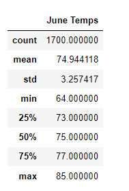
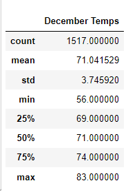

# surfs_up
## Overview of the analysis:
This project provide weather analysis to make W. Avy ,the investor, feeling save for this investment.

## Results:

* Accroding to the picture of June_Temp and December_Temp, we know the average temperature of June is warmer than the temperature of December, so is better to open business in june.

* The count of June Temps data is larger than the count of December Temp data, which mean in june there are more opportunity for selling ice cream.

* The std of June Temps is smaller than December which mean the weather might be stable in june.

## Summary:
To sum up, because of the weather will be hotter and have less rain in june, it is going to be easier to start this business in june.

With query "SELECT date, prcp FROM 'Measurement' where strftime('%m', date) = '06';" and "SELECT date, prcp FROM 'Measurement' where strftime('%m', date) = '12';" we can tell the difference of precipitation between june and december.

With "SELECT station ,strftime('%m', date) AS 'month', SUM(prcp) FROM 'Measurement' where month = '06' group by station,strftime('%m', date);" and "SELECT station ,strftime('%m', date) AS 'month', SUM(prcp) FROM 'Measurement' where month = '12' group by station,strftime('%m', date);" we can compare the precipitation for each station.